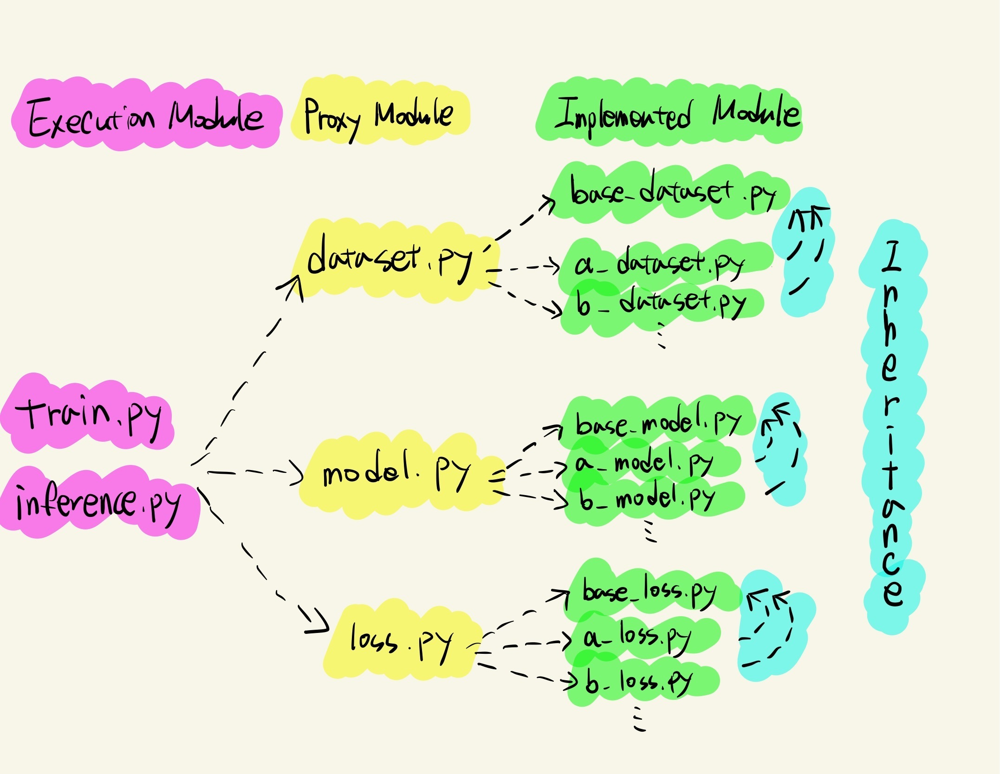

## 🦢 BoostCamp AI Tech 2nd 🦢 
### 🐧 삼식이's First P Stage Project 🐧
 

부스트캠프 AI Tech 2기 32조의 마스크 착용 상태 분류 프로젝트 입니다.   

 

#### Members🐣

- 김종현
- 김준섭
- 유관식
- 이윤영
- 조성욱
- 한태호

## Project Architecture       

## Getting Started    
### Dependencies
- torch==1.6.0
- torchvision==0.7.0
- tensorboard==2.4.1
- pandas==1.1.5
- opencv-python==4.5.1.48
- scikit-learn~=0.24.1
- matplotlib==3.2.1
---               

### Install Requirements
- `pip install -r requirements.txt`

### Training
- `python train.py`
- output : ./lab/[PersonalId or anonymous]/model/**
### Inference
- `python inference.py`
- output : ./lab/[PersonalId or anonymous]/output/output.csv

### Workspace env
- vi /etc/bash.bashrc
- export MYNAME=`[PersonalId]`
- source /etc/bash.bashrc

### Wandb login
- pip install wandb
- wandb login 
- https://wandb.ai/authorize 에서 api key 복사 후 터미널 입력

### nohup (background execution)
- chmod 711 some_task.sh   
- nohup some_task.sh 1>/dev/null 2>&1 &     